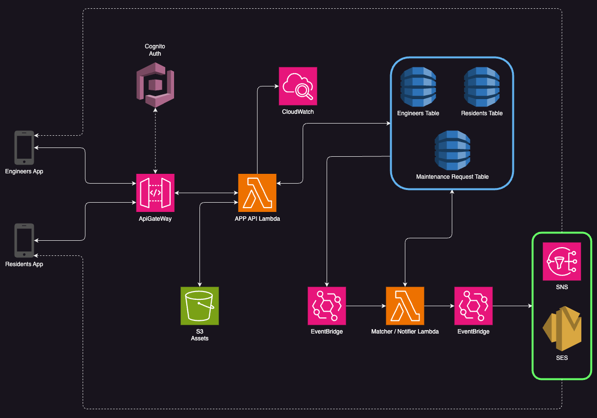
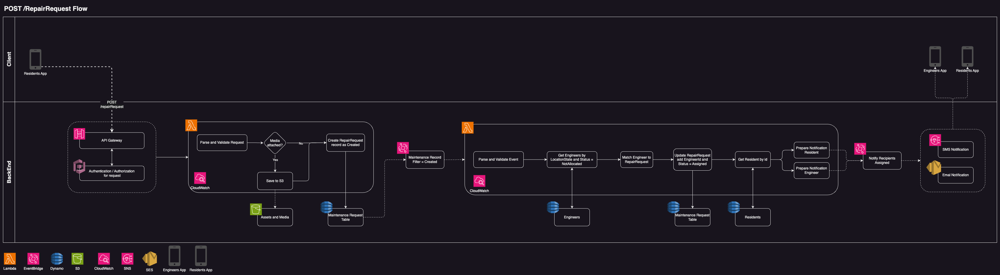
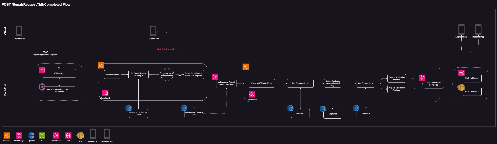
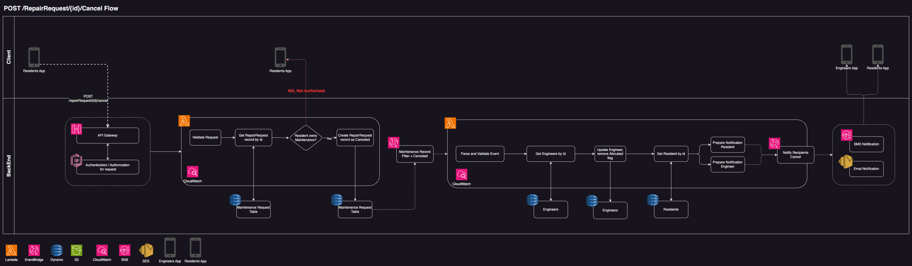
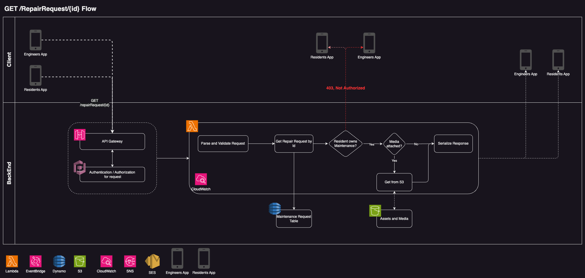

# Simple Repair Request System

## Table of Contents
- [High-Level Design](#high-level-design)
- [System Requirements](#system-requirements)
   - [Functional Requirements](#functional-requirements)
   - [Non-Functional Requirements](#non-functional-requirements)
- [Architecture Overview](#architecture-overview)
- [Data Flow](#data-flow)
   - [Request Creation Flow](#request-creation-flow)
   - [Request Resolution Flow](#request-resolution-flow)
   - [Request Cancel Flow](#request-cancel-flow)
   - [Request Get Flow](#request-get-flow)
- [Conclusion](#conclusion)

## High-Level Design
The goal of this system is to design a scalable, cloud-based solution to manage maintenance requests for 10k+ single-family rental homes across 30+ cities. The system must provide functionality for creating, and resolving service requests efficiently, while ensuring high availability and optimized resource utilization for the 100 property contractors. The solution will leverage AWS services for scalability, fault tolerance, and ease of maintenance.

### System Requirements

#### Functional Requirements

1. Request Management: Residents should be able to create, get information, and cancel/close service requests.
2. Engineer Assignment: Assign requests to property engineers based on location, and availability.
3. Notifications: Notify residents and engineers about updates (e.g., assignment, cancellation, completion).

#### Non-Functional Requirements

1. Scalability: Support 10,000+ homes with 100 engineers across 30+ cities.
2. High Availability: 99.9% uptime to handle requests in real-time.
3. Security: Ensure secure data access and storage.
4. Cost Optimization: Minimize operational costs using serverless.

### Architecture Overview
The proposed architecture will use AWS serverless and managed services to ensure scalability, fault tolerance, and low operational overhead.

Overview of the system architecture:

 

Key Components

1. Frontend Application:
   1. Interfaces: Web and mobile apps for residents and engineers. 
   2. Tech Stack: Angular or React (web), Flutter or React Native (mobile).
2. Backend Services:
   1. Built using Python (AWS Lambda) for stateless, scalable business logic. 
   2. Orchestrates request management, notifications, and analytics.
3. Database:
   1. Amazon DynamoDB for service request data (scalable, fast NoSQL).
4. Notifications:
   1. Amazon SNS or SES for email and SMS notifications.
5. Storage:
   1. Amazon S3 for storing images, invoices, and other media related to maintenance requests.
6. Authentication:
   1. Amazon Cognito for user authentication and authorization (residents, engineers, etc.).
7. Monitoring and Analytics:
   1. Amazon CloudWatch for logging and metrics.
8. API Gateway:
   1. Amazon API Gateway to expose RESTful APIs for frontend-backend communication.

### Data Flow
#### Request Creation Flow

1. A resident creates a service request using the frontend application.
2. The frontend app sends the request to the backend API Gateway.
3. API Gateway triggers a Lambda function to process the request.
4. The Lambda function validates the request, stores it in DynamoDB, and sends a notification to the assigned engineer.

#### Request Resolution Flow

1. An engineer marks the service request as completed using the frontend app.
2. The frontend app sends the request to the backend API Gateway.
3. API Gateway triggers a Lambda function to update the request status in DynamoDB.
4. The Lambda function sends a notification to the resident about the completion.

#### Request Cancel Flow

1. A resident cancels a service request using the frontend application.
2. The frontend app sends the request to the backend API Gateway.
3. API Gateway triggers a Lambda function to process the request.
4. The Lambda function updates the request status in DynamoDB and sends a notification to the assigned engineer.

#### Request Get Flow

1. A resident requests information about a service request using the frontend application.
2. The frontend app sends the request to the backend API Gateway.
3. API Gateway triggers a Lambda function to fetch the request details from DynamoDB.
4. The Lambda function retrieves the request details and sends the response to the frontend app.

## Conclusion
The proposed system architecture provides a scalable, cost-effective solution for managing maintenance requests for a large number of single-family rental homes. By leveraging AWS serverless services, the system can handle high request volumes, ensure high availability, and optimize operational costs. The use of managed services like DynamoDB, S3, and API Gateway simplifies maintenance and reduces the need for infrastructure management. The architecture can be further enhanced with features like auto-scaling, caching, and load balancing to meet future requirements and improve performance.

    